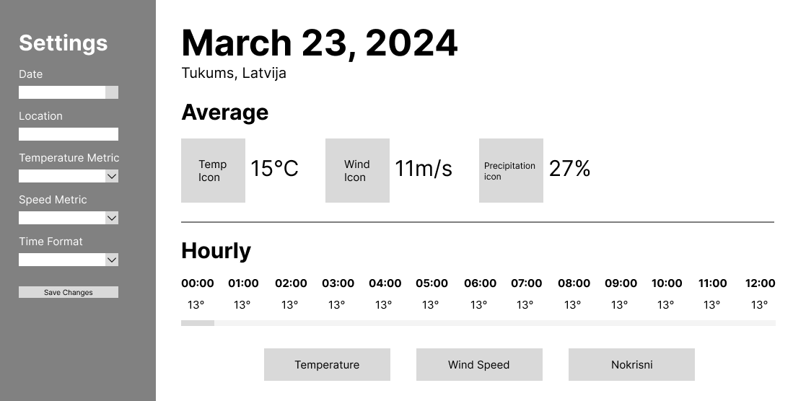
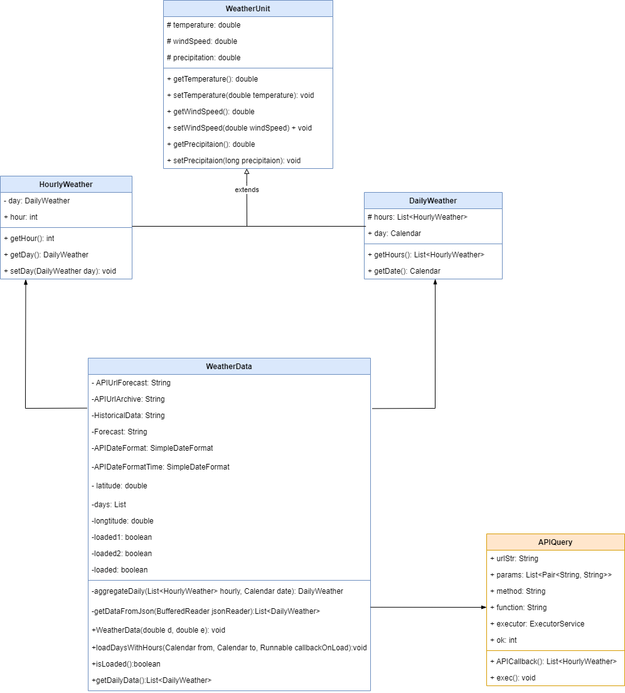
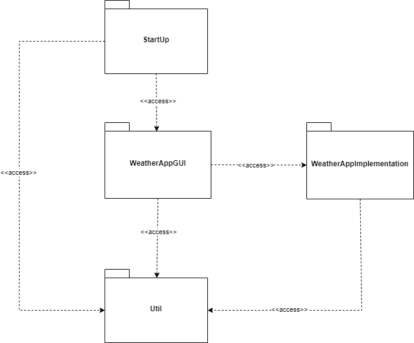

# Laikapstākļu prognožu programma

Grupu darba ietvaros izstrādāts projekts kursā  __DatZ4019-LV : Objektorientētā programmēšana__ .

 

__Grupas dalībnieki/izstrādātāji:__
- Jānis Andis Lapāns, jl21081;
- Gustavs Jaundžeikars, gj21029;
- Edgars Bautra, eb21122;
- Mārtiņš Vītols, mv21087;
- Edgars Bērziņš, eb21145.

 

# Programmas koncepcija/prasību specifikācija

## Īss apraksts

Grupu darba ietvaros tika izstrādāta laikapstākļu prognožu programma, kas, balstoties pēc 
konkrētas atrašanās vietas un datuma spēs parādīt attiecīgās laika prognozes.

 

Lietotājam ir iespēja noklusēti redzēt laikapstākļus pašreizējā laikā sev tuvumā, taču ir arī 
iespējams atlasīt sev vēlamo atrašanās vietu, kurai noskaidrot laikapstākļu informāciju, kā arī 
lietotājam ir arī iespējams izvēlēties līdz 15 dienām uz priekšu vai jebkuru datumu pirms pašreizējā
līdz pieejamo datu robežai.

 

Pieejamā informācija iekļauj:
- Vidējo gaisa temperatūru;
- Vidējo vēja ātrumu;
- Vidējo nokrišņu daudzumu;
- Gaisa temperatūru pa stundām;
- Vēja ātrumu pa stundām;
- Nokrišņu daudzumu pa stundām.

 

Visa nepieciešamā informācija tika iegūta no sekojošā API: https://open-meteo.com/en/docs

## Darījumprasības

Projekts tika izstrādāts ņemot vērā šādas darījumprasības kā sasniedzamo mērķi:
- Iespēja lietotājam atverot programmu redzēt informāciju par laikapstākļiem pēc pašreizējās
atrašanās vietas un datuma;
- Iespēja lietotājam pārslēgt un redzēt kādu konkrētu laikapstākļu īpašību pa stundām konkrētajā
diennaktī, klikšķinot uz attiecīgās pogas;
- Iespēja lietotājam izvēlēties sev vēlamo datumu 15 dienu intervālā uz priekšu, kā arī redzēt
informāciju par iepriekšējiem datumiem;
- Iespēja lietotājam ievadīt un izvēlēties citu atrašanās vietu, par kuru vēlas iegūt laikapstākļu datus;
- Iespēja lietotājam izvēlēties vai vēja ātrums tiek attēlots ar mērvienību "km/h" vai "m/s";
- Iespēja liettoājam izvēlēties vai temeratūra tiks rādīta celsija vai fārenheita grādos;
- Iespēja lietotājam izvēlēties attēloto laika formātu starp 24 un 12 stundu sistēmas;
- Iespēja lietotājam atjaunot veiktās izmaiņas iestatījumiem uz noklusētām vērtībām.
- Lietotāja veiktās un saglabātās izmaiņas iestatījumos tiek automātiski saglabātas un paliek spēkā
nākamo reizi atverot programmu.

 

## Citas prasības

Tā kā programmas izstrādes ietvaros tika izveidots saskarnes projektējums, programmai jābūt pēc iespējas
līdzīgai šim projektējumam:

 

## Diagrammas

# Klašu diagramma

Šī klašu diagramma attēlo 5 no programmas klāsēm, kur 4 ir no pakotnes "WeatherAppImplementation" un 1 no pakotnes "Util".

- Klase "WeatherUnit" ir abstrakta klase, kuru paplašina klases "HourlyWeather" un "DailyWeather". Šīs klases kopumā kalpo kā
datu struktūras iegūtajiem datiem;
- Klase "WeatherData" izmanto klases "HourlyWeather" un "DailyWeather" datu iegūšanas procesā. Kā papildus lieta, ko izmanto šī klase ir
klase "APIQuery" no pakotnes "Util";
- Klase "APIQuery" nodrošina vaicājuma izveidi un darbināšanu, lai iegūtu datus no izmantotā API.

# Pakotņu diagramma

Pakotņu diagrammā attēlotas visas 4 pakotnes, kurās ir sadalīta programmas darbība.

- Pakotne "StartUp"  darbina klases pakotnē "WeatherAppGUI", papildus izmantojot arī
klases no pakotnes "Util";
- Pakotne "WeatherAppGUI" nodrošina saskarnes funkcionalitāti, attēlojot informāciju,
kas tiek iegūta no pakotnes "WeatherAppImplementation" klasēm. Papildus tiek arī izmantota
funkcionalitāte no klasēm, kas atrodas pakotnē "Util";
- Pakotne "WeatherAppImplementation" nodrošina datu ieguvi un apstrādi, pielietojot
funkcionalitāti no klasēm, kuras atrodas pakotnē "Util";
- Pakotne "Util" sastāv no klasēm, kas satur palīgfunkcijas, kuras izmanto pārējās klases.

# Secību diagramma

Diagramma parāda API izsaukuma sagatavošanu, izsaukšanu, kļūdu apstrādi un JSON faila interpretēšanu.
Apstrāde mainīsies atkarībā no tā, vai lietotājs vēlēsies uzzināt datus par nākotnes dienām vai pagātnes dienām.

# Prezentācija

Prezentācija ir pieejama [šeit](https://docs.google.com/presentation/d/17UzA_lcUijxI2zewzcfCjoj7BDOOoEIo/edit?usp=drive_link&ouid=114194349111779554858&rtpof=true&sd=true).
